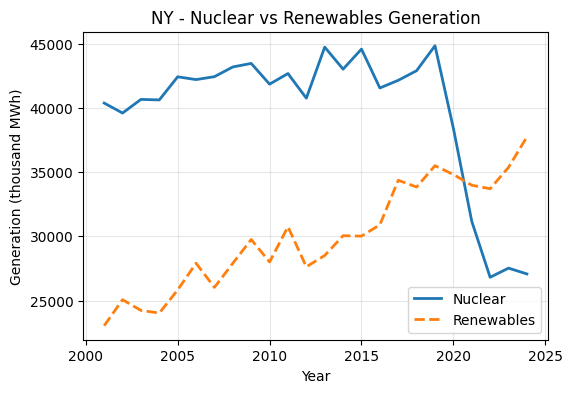

# Nuclear vs Renewables

Comparative analysis of annual electricity generation from **nuclear** and **renewables** (wind, solar, hydro) using the U.S. Energy Information Administration API
Built and documented in Google Colab

## What's inside:
* End-to-end pipeline: API → pandas → Matplotlib
* Policy-aware interpretation for each state
* Notebook ready to run with your own EIA API key

## How to run:
1. Get a free EIA API key: <https://www.eia.gov/opendata/>.
2. Click **Open in Colab** above.
3. Paste your key into 'API_KEY = "..."', then **Runtime ▸ Run all**.

## Skills demonstrated:
* REST API
* Data wrangling in pandas
* Analysis with visualizations
